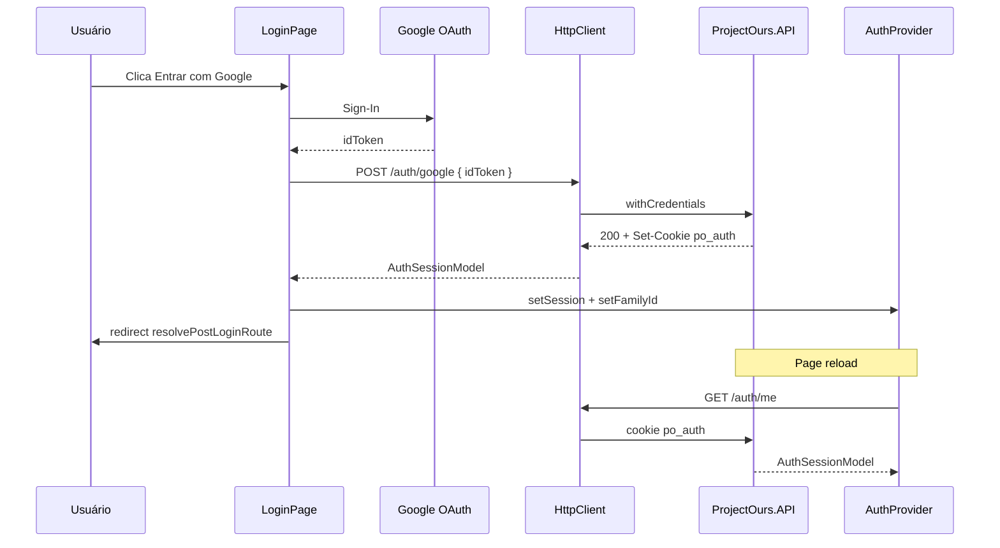
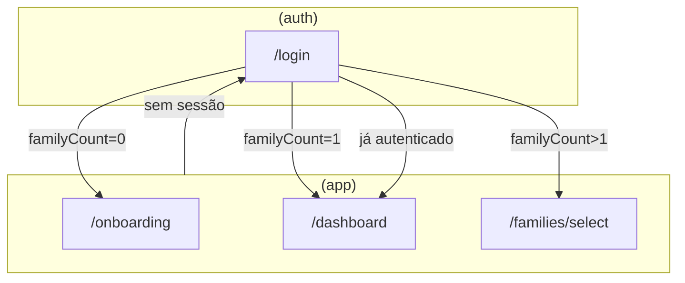

# Login / Logout — Design

**Spec:** `.specs/changes/003-login-logout-flow/spec.md`  
**Context:** `.specs/changes/003-login-logout-flow/context.md`  
**Status:** Draft

---

## Architecture Overview

Fluxo cookie-first: Google emite `idToken` no browser → API valida e seta `po_auth` → client mantém `AuthSessionModel` em React Context (não persiste token). Sessão sobrevive reload via `GET /auth/me`.





---

## Code Reuse Analysis

### Existing Components to Leverage

| Component | Location | How to Use |
|-----------|----------|------------|
| `AuthLoginGoogleUseCase` | `core/services/usecases/auth/login-google.usecase.ts` | Manter; hook já chama |
| `resolvePostLoginRoute` | `core/services/usecases/auth/resolve-post-login-route.ts` | Usar após login/restore |
| `HttpClient` | `core/infra/http/http-client.ts` | Cookie + antiforgery + 401 |
| `AuthProvider` | `presentation/providers/auth/` | Estender com loading + logout |
| `FamilyProvider` | `presentation/providers/family/` | Auto-set familyId |
| `setupAuthMocks` | `core/services/usecases/auth/index.mock.ts` | Estender `/auth/me`, `/auth/logout` |
| `HomePage` CTA | `presentation/modules/home/` | Link para `/login` |

### Concerns Mitigation

| Concern (CONCERNS.md) | Mitigation |
|-----------------------|------------|
| Server JWT-only | Implementar cookie auth neste change (D7) |
| CORS sem credentials | `AllowCredentials()` + origem explícita |
| 401 → `/login` sem rota | T1 cria rota login |

---

## Components

### Client

| Component | Path | Responsibility |
|-----------|------|----------------|
| `GoogleOAuthProvider` | `presentation/providers/google-oauth/` | Wrap `@react-oauth/google` |
| `LoginPage` | `presentation/modules/auth/login/` | UI + handler Google |
| `AuthGuard` | `presentation/modules/auth/auth-guard/` | Redirect se !auth |
| `GuestGuard` | `presentation/modules/auth/guest-guard/` | Redirect se auth |
| `AppShellStub` | `presentation/modules/app-shell/` | Header mínimo + botão Sair |
| `get-session.usecase` | `core/services/usecases/auth/` | GET `/auth/me` |
| `logout.usecase` | `core/services/usecases/auth/` | POST `/auth/logout` |
| `useSession` | `core/services/usecases/auth/index.hooks.ts` | Query session bootstrap |
| `useLogout` | `core/services/usecases/auth/index.hooks.ts` | Mutation logout |
| Routes | `app/[locale]/(auth)/login`, `(app)/dashboard`, etc. | Rotas finas |

### Server

| Component | Path | Responsibility |
|-----------|------|----------------|
| `AuthController` | `ProjectOurs.API/Controllers/` | google, me, logout, antiforgery |
| Cookie helper | `ProjectOurs.API/` ou Infrastructure | Append/delete `po_auth` |
| Google token validator | Application/Infrastructure | Validar idToken (Google APIs) |
| CORS policy | `Program.cs` | Credentials + origin client |

---

## Data Models

Sem alteração em `AuthSessionModel`. Extensões em `IAuth`:

```typescript
// index.contract.ts — adicionar
getSession(): Promise<GoogleAuthResponse>;
logout(): Promise<void>;
```

---

## i18n

Namespace `auth` em `pt-BR.json`:

- `login.title`, `login.subtitle`, `login.ctaGoogle`, `login.error`
- `logout.cta`, `logout.error`
- `session.loading`

---

## Env & Config

| Variable | Uso |
|----------|-----|
| `NEXT_PUBLIC_GOOGLE_CLIENT_ID` | GoogleOAuthProvider |
| `NEXT_PUBLIC_API_URL` | Rewrite target (dev) |
| `NEXT_PUBLIC_APP_URL` | CORS origin server |

---

## Risks

| Risk | Mitigation |
|------|------------|
| Google idToken validation complexa | Dev stub aceita token mock; prod valida com Google.Apis.Auth |
| Cookie cross-origin sem rewrite | T8 rewrite same-origin |
| Flash of redirect | `isSessionLoading` nos guards |

---

## References

- ec-v3-ui: `presentation/providers/auth` (logout pattern — adaptar para cookie)
- ours-client-standard: camadas domain → usecase → hooks → modules
