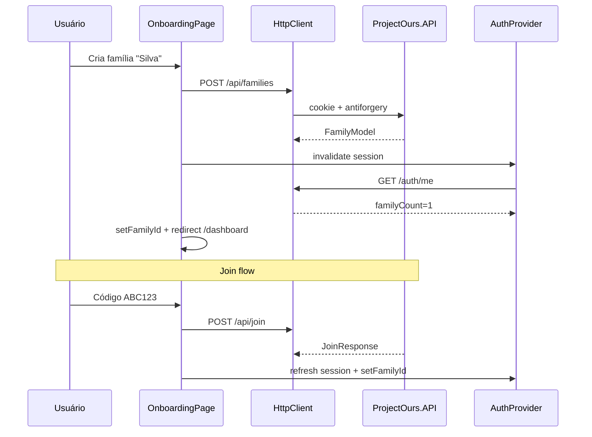

# Family Management — Design

**Spec:** `.specs/features/family/spec.md`  
**Context:** `.specs/changes/004-family-management/context.md`  
**Status:** Draft

---

## Architecture Overview

Família é o primeiro domínio pós-auth com mutações scoped. Create/join alteram memberships → sessão auth deve ser refreshed. Invite exige família ativa (`X-Family-Id`) e role Admin da API.



```mermaid
flowchart LR
    subgraph onboarding
        create[Criar família]
        join[Entrar com código]
    end
    create --> dashboard
    join --> dashboard
    select[/families/select] --> dashboard
    dashboard --> invite[Modal convite Admin]
```

---

## Code Reuse Analysis

### Existing Components to Leverage

| Component | Location | How to Use |
|-----------|----------|------------|
| `IFamily` contract | `core/domain/family/index.contract.ts` | Estender métodos invite/join |
| `FamilyProvider` | `presentation/providers/family/` | `setFamilyId` após create/join/select |
| `applyActiveFamilyFromSession` | `core/services/usecases/auth/` | Após refresh sessão |
| `HttpClient` | `core/infra/http/` | Cookie + antiforgery + `X-Family-Id` |
| `AuthProvider` + `useSession` | `presentation/providers/auth/` | Invalidate/refetch pós-mutação |
| Domain entities | `server/.../Domain/Entities/` | Family, Membership, Invite já mapeados |
| `AuthService.BuildSession` | `Application/Auth/` | Reutilizar shape de families na sessão |
| Stub pages | `presentation/modules/stubs/` | Substituir por módulos `family/` |

### Concerns Mitigation

| Concern | Mitigation |
|---------|------------|
| Stubs family (CONCERNS.md) | Este change implementa módulos reais |
| Roles no web | Ler `role` de `AuthSessionModel.families`, não decodificar JWT |
| Integration tests Docker | Smoke tests opcionais; unit tests obrigatórios server |

---

## Components

### Server

| Component | Path | Responsibility |
|-----------|------|----------------|
| `IFamilyRepository` | `Application/Abstractions/Persistence/` | CRUD família, membership, invite |
| `FamilyRepository` | `Infrastructure/Persistence/` | EF queries |
| `FamilyService` | `Application/Family/` | Regras create/list/invite/join |
| `InviteCodeGenerator` | `Application/Family/` | 6 chars crypto-safe |
| `FamiliesController` | `API/Controllers/` | POST/GET families |
| `InvitesController` | `API/Controllers/` | POST invite, POST join |
| `FamilyAuthorization` | `API/` ou filters | Validar Admin + membership |

### Client

| Component | Path | Responsibility |
|-----------|------|----------------|
| Domain models | `core/domain/family/index.ts` | Invite/join DTOs |
| Use cases | `core/services/usecases/family/*.usecase.ts` | HTTP calls |
| Hooks | `core/services/usecases/family/index.hooks.ts` | Mutations + invalidate auth |
| `OnboardingPage` | `presentation/modules/family/onboarding/` | Create + join UI |
| `FamilySelectPage` | `presentation/modules/family/select/` | Lista + pick |
| `InviteModal` | `presentation/modules/family/invite/` | Admin gera/copia código |
| Dashboard patch | `presentation/modules/stubs/dashboard.tsx` | Botão convite se Admin |

---

## Data Models

### Client (extensões)

```typescript
export type FamilyWithRoleModel = FamilyModel & { role: 'Admin' | 'Member' };

export type CreateInviteRequest = { invitedEmail?: string };
export type CreateInviteResponse = { inviteCode: string; expiresAt: string };

export type JoinFamilyRequest = { inviteCode: string };
export type JoinFamilyResponse = {
  familyId: string;
  familyName: string;
  role: 'Member';
};
```

### Server DTOs

```csharp
public sealed record CreateFamilyRequest(string Name);
public sealed record FamilyDto(string Id, string Name);
public sealed record FamilyWithRoleDto(string Id, string Name, string Role);
public sealed record CreateInviteRequest(string? InvitedEmail);
public sealed record InviteDto(string InviteCode, DateTimeOffset ExpiresAt);
public sealed record JoinRequest(string InviteCode);
public sealed record JoinResponse(string FamilyId, string FamilyName, string Role);
```

---

## Error Handling Strategy

| Scenario | HTTP | User message (pt-BR) |
|----------|------|----------------------|
| Nome inválido | 400 | Nome deve ter entre 1 e 100 caracteres |
| Código inválido | 404 | Código não encontrado |
| Convite expirado | 400 | Este convite expirou |
| Já é membro | 409 | Você já faz parte desta família |
| Não é Admin (invite) | 403 | Apenas o admin pode convidar |
| Sem X-Family-Id | 400 | Família ativa não informada |

---

## Tech Decisions

| Decision | Choice | Rationale |
|----------|--------|-----------|
| Controller split | Families + Invites | Alinha api-contracts (`/families`, `/invite`, `/join`) |
| Session refresh | Invalidate React Query auth key | Single source for familyCount |
| Invite code charset | A-Z0-9, 6 chars | DB constraint + UX (case insensitive input normalized uppercase) |
