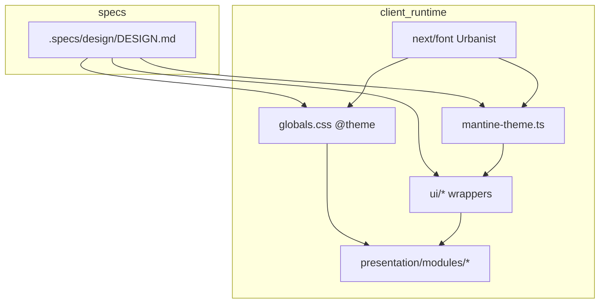
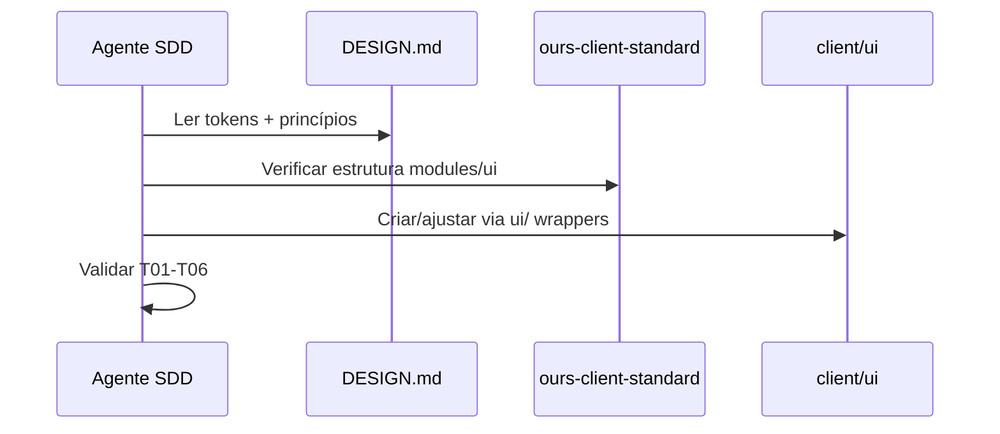

# Change 005 — Design (architecture)

**Spec:** `.specs/changes/005-design-specification/spec.md`  
**Canonical:** `.specs/design/DESIGN.md`  
**Context:** `.specs/changes/005-design-specification/context.md`  
**Status:** Draft

---

## Architecture Overview

O design system é **spec-first, runtime-second**: `DESIGN.md` define tokens agnósticos de framework; o client os materializa em três camadas sincronizadas.



**Regra de ouro:** `presentation/modules/` nunca importa `@mantine/core` nem declara hex. Toda cor vem do tema Mantine ou CSS var.

---

## Code Reuse Analysis

### Existing Components to Leverage

| Component | Location | How to Use |
|-----------|----------|------------|
| `mantineTheme` | `presentation/styles/mantine-theme.ts` | Estender com paleta custom e `primaryColor` |
| `globals.css` | `presentation/styles/globals.css` | `@theme inline` + `:root` vars |
| `MantineProviderRoot` | `presentation/providers/mantine/` | Já injeta theme |
| `ui/*` wrappers | `client/src/ui/` | Ajustar `defaultProps` nos wrappers, não nos modules |
| `render-with-providers` | `test/setup.ts` | Testes herdam tema automaticamente |
| Layout root | `app/[locale]/layout.tsx` | Carregar Urbanist; `themeColor` → `serenity_green_60` |

### Concerns Mitigation

| Concern | Mitigation |
|---------|------------|
| Mantine shades (10-step arrays) | Gerar shades a partir dos hex base; documentar em `design-tokens.ts` |
| Tailwind + Mantine coexistence | CSS vars como bridge; Tailwind usa `var(--color-*)` |
| Telas existentes quebram visualmente | Retema global é esperado; smoke em login + dashboard |
| Geist → Urbanist | Substituir em layout + theme; remover refs Geist |

---

## Token Mapping

### Mantine custom colors

Mantine exige arrays de 10 shades. Mapeamento proposto (índice 6 = tom base):

| Token DESIGN.md | Mantine key | Shade 6 (base) |
|-----------------|-------------|----------------|
| `serenity_green_60` | `green` | `#5A6838` |
| `mindful_brown_100` | `brown` | `#6B5843` |
| `empathy_orange_50` | `orange` | `#C86900` |
| `bg_dark_green` | `darkGreen` | `#2D3E26` |
| `bg_cream` | — | CSS var `--color-bg-cream` |
| `text_dark_brown` | — | CSS var + `theme.other` |

```typescript
// presentation/styles/design-tokens.ts (novo)
export const designTokens = {
  colors: {
    mindfulBrown: '#6B5843',
    serenityGreen: '#5A6838',
    empathyOrange: '#C86900',
    bgCream: '#FCF8F4',
    bgDarkGreen: '#2D3E26',
    bgOrange: '#F6852D',
    textDarkBrown: '#2E1E12',
    textLight: '#FFFFFF',
    textGray: '#6B6B6B',
  },
  radius: { sm: 8, md: 12, lg: 16, xl: 24, pill: 999 },
  spacing: [4, 8, 12, 16, 20, 24, 32, 40, 48, 64, 80],
} as const;
```

### CSS variables (`globals.css`)

```css
:root {
  --color-bg-cream: #FCF8F4;
  --color-text-primary: #2E1E12;
  --color-mindful-brown: #6B5843;
  --color-serenity-green: #5A6838;
  --color-empathy-orange: #C86900;
  --radius-sm: 8px;
  --radius-md: 12px;
  --radius-lg: 16px;
}
```

### Tailwind `@theme inline`

```css
@theme inline {
  --color-background: var(--color-bg-cream);
  --color-foreground: var(--color-text-primary);
  --color-primary: var(--color-serenity-green);
  --font-sans: var(--font-urbanist);
}
```

---

## Components

### Novos / alterados

| Component | Path | Responsibility |
|-----------|------|----------------|
| `design-tokens.ts` | `presentation/styles/` | Fonte única de hex no código; importada por theme |
| `mantine-theme.ts` | `presentation/styles/` | `createTheme` com cores, radius, font Urbanist |
| `globals.css` | `presentation/styles/` | CSS vars + Tailwind theme |
| `generate-mantine-shades.ts` | `presentation/styles/` | Util para derivar 10 shades (opcional, inline ok) |
| `Button` wrapper | `ui/DataDisplay/Button/` | `defaultProps`: radius md, cores primárias |
| `TextInput` wrapper | `ui/DataEntry/TextInput/` | radius sm |
| Font loader | `app/[locale]/layout.tsx` | `Urbanist` via `next/font/google` |

### Adiado (spec only)

| Component | Path | When |
|-----------|------|------|
| `WaveTabBar` | `ui/Navigation/WaveTabBar/` | M3+ navegação principal |
| `Badge` | `ui/DataDisplay/Badge/` | Quando features precisarem pills |

---

## Font Loading

```typescript
// app/[locale]/layout.tsx
import { Urbanist } from 'next/font/google';

const urbanist = Urbanist({
  subsets: ['latin'],
  variable: '--font-urbanist',
  weight: ['400', '500', '600', '700', '800'],
});
```

Aplicar `urbanist.variable` no `<html>` e referenciar em `mantineTheme.fontFamily`.

---

## Agent Workflow Integration



Toda task de UI em `.specs/changes/*/tasks.md` deve incluir:

```markdown
**Design:** `.specs/design/DESIGN.md` — princípios [P0X, ...]
```

---

## Verification

| Check | Command / method |
|-------|------------------|
| Build + types | `npm run type-check` |
| Unit tests | `npm run test` |
| Full gate | `npm run pre-push:checks` |
| Visual smoke | Login page cream bg; botão verde primário |
| Conformance | Checklist T01–T06 manual em PR |

---

## File Touch List (implementação)

```
client/src/presentation/styles/design-tokens.ts     [new]
client/src/presentation/styles/mantine-theme.ts     [edit]
client/src/presentation/styles/globals.css            [edit]
client/src/app/[locale]/layout.tsx                    [edit]
client/src/ui/DataDisplay/Button/index.tsx            [edit]
client/src/ui/DataEntry/TextInput/index.tsx           [edit]
.specs/design/DESIGN.md                               [done]
.cursor/skills/ours-client-standard/SKILL.md          [edit]
.specs/codebase/CONVENTIONS.md                        [edit]
```
