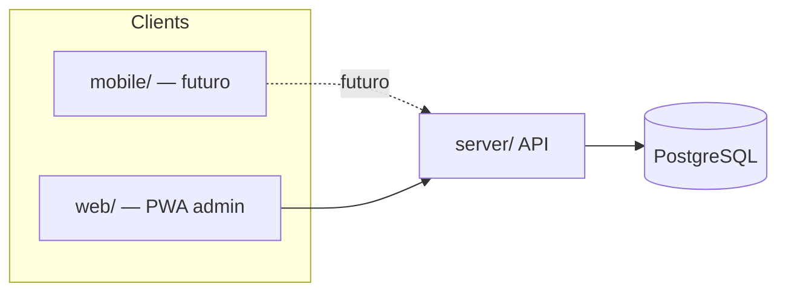

# Design — Change 006 Client Platform Split

## Arquitetura alvo

```text
project-ours/
├── mobile/          # Cliente principal (placeholder)
│   └── README.md
├── web/             # PWA admin/suporte (ex-client/)
│   └── src/         # Next.js App Router — estrutura inalterada
├── server/          # API REST .NET 8 — inalterado
└── .specs/
    └── shared/platforms.md
```

## Fluxo de comunicação



## Decisões de design

### D1: Rename físico vs documental

**Decisão:** rename físico `client/` → `web/` neste change.  
**Motivo:** evitar drift entre docs e filesystem; breaking explícito uma vez.

### D2: Placeholder mobile

**Decisão:** apenas `mobile/README.md` com visão, escopo futuro e link para `platforms.md`.  
**Motivo:** reservar diretório sem comprometer stack (React Native, Expo, Flutter — TBD).

### D3: Fase ponte no web

**Decisão:** `web/` continua implementando MVP completo até existir `mobile/` M0.  
**Motivo:** produto utilizável; poda de consumer features é change separado pós-mobile.

### D4: Design system

**Decisão:** `.specs/design/DESIGN.md` permanece canonical; paths em tasks 005 apontam para `web/src/`.  
**Motivo:** tokens já integrados no web; mobile importará mesmos tokens quando iniciar.

### D5: Skill

**Decisão:** atualizar `ours-client-standard` in-place (paths `web/`) sem renomear skill neste change.  
**Motivo:** menor churn; rename da skill pode ser quick task posterior.

## Impacto em changes ativos

| Change | Ação |
|--------|------|
| 004-family-management | Atualizar paths `client/` → `web/` em tasks; escopo inalterado |
| 005-design-specification | Arquivar; DESIGN.md permanece em `.specs/design/` |

## O que não muda

- Estrutura interna `web/src/` (core/domain, presentation, ui)
- Server layers (API → Application → Domain → Infrastructure)
- Contratos HTTP e auth cookie
- Husky hooks (relocam com o pacote `web/`)

## Riscos e mitigação

| Risco | Mitigação |
|-------|-----------|
| Scripts/CI com `cd client` | Task T2 atualiza README, package.json, husky paths |
| Agentes referenciam `client/` em memória | STATE.md + platforms.md como fonte atualizada |
| Confusão web=produto principal | PROJECT.md vision clara: mobile-first |
