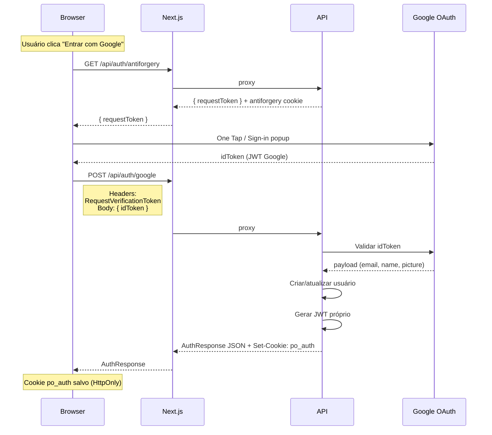
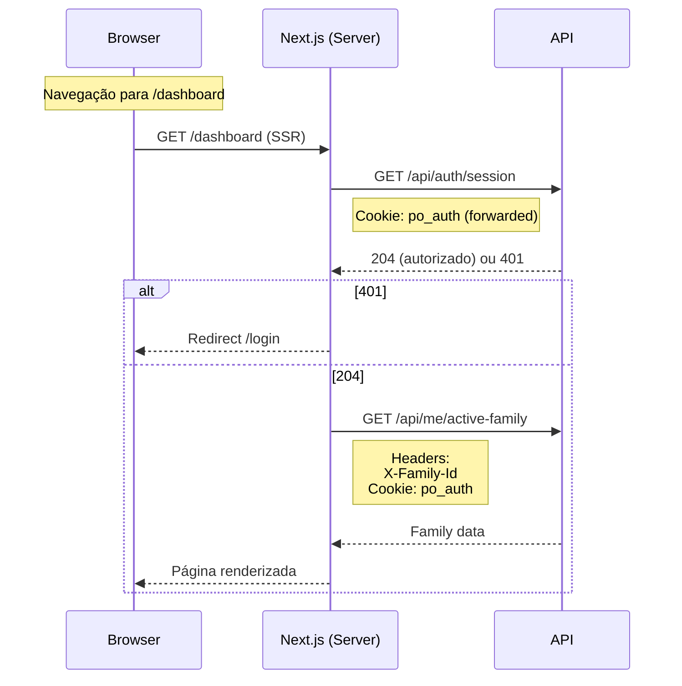

# Project Ours - Fluxo de Login

> **How-to**: Entenda e teste o fluxo completo de autenticação

---

## Visão Geral

O Ours usa **Google OAuth** para autenticação, com sessão mantida em **cookie HttpOnly** (`po_auth`) e proteção **antiforgery** em mutações.

```
┌─────────────┐     ┌─────────────┐     ┌─────────────────┐
│   Browser   │────▶│  Next.js    │────▶│  ProjectOurs    │
│  (frontend) │◀────│   (proxy)   │◀────│     API         │
└─────────────┘     └─────────────┘     └─────────────────┘
                           │
                           ▼
                    Google OAuth
```

---

## Diagrama de Sequência

### Login Completo



### Verificação de Sessão



---

## Destinos Pós-Login

| Condição | Destino | Descrição |
|----------|---------|-----------|
| `isNewUser=true` | `/onboarding` | Primeira vez no app, criar família |
| `familyCount=0` | `/onboarding` | Usuário existe mas sem família |
| `familyCount=1` | `/dashboard` | Uma família, entrar direto |
| `familyCount>1` | `/families/select` | Múltiplas famílias, escolher qual |

```typescript
// Lógica de roteamento
function resolvePostLoginRoute(response: AuthResponse): string {
  if (response.isNewUser || response.familyCount === 0) {
    return '/onboarding';
  }
  if (response.familyCount === 1) {
    return '/dashboard';
  }
  return '/families/select';
}
```

---

## Endpoints de Auth

### GET /api/auth/antiforgery

Obtém token antiforgery para uso em mutações.

**Response (200):**
```json
{
  "requestToken": "CfDJ8Cu..."
}
```

**Cookies set:**
- `.AspNetCore.Antiforgery.*` — cookie antiforgery

---

### POST /api/auth/google

Autenticação via Google OAuth.

**Headers:**
```
Content-Type: application/json
RequestVerificationToken: {token_do_antiforgery}
```

**Request:**
```json
{
  "idToken": "eyJhbG..."
}
```

**Response (200):**
```json
{
  "user": {
    "id": "uuid",
    "email": "user@email.com",
    "name": "João Silva",
    "picture": "https://...",
    "families": []
  },
  "isNewUser": true,
  "familyCount": 0
}
```

**Cookies set:**
- `po_auth` — JWT HttpOnly, 24h

**Erros:**
- `400` — Missing antiforgery token
- `401` — Token Google inválido
- `403` — Email não verificado

---

### GET /api/auth/session

Verifica se sessão é válida (para SSR/redirects).

**Cookies enviados:**
- `po_auth`

**Response:**
- `204` — Sessão válida
- `401` — Sessão inválida ou expirada

---

### POST /api/auth/logout

Encerra sessão.

**Headers:**
```
RequestVerificationToken: {token_renovado}
```

**Response:**
- `204` — Logout OK (cookie removido)

---

## Erros de UX

| Erro | Causa | Mensagem ao Usuário |
|------|-------|---------------------|
| **Antiforgery** | Token expirado ou inválido | "Sessão expirada. Tente novamente." |
| **Google 401** | Popup fechado ou erro Google | "Login cancelado. Tente novamente." |
| **Email não verificado** | Conta Google sem verificação | "Verifique seu email no Google para continuar." |
| **API indisponível** | Backend offline | "Serviço indisponível. Tente mais tarde." |

---

## Variáveis de Ambiente

### Frontend (.env.local)

```bash
# Google OAuth Web Client ID
NEXT_PUBLIC_GOOGLE_CLIENT_ID=seu-client-id.apps.googleusercontent.com

# Backend URL (para proxy Next.js)
BACKEND_URL=http://127.0.0.1:5280
```

### Backend (appsettings.Development.json)

```json
{
  "Authentication": {
    "Google": {
      "ClientId": "seu-client-id.apps.googleusercontent.com"
    }
  },
  "JwtSettings": {
    "Secret": "sua-chave-super-secreta-32-chars!",
    "Issuer": "project-ours-api",
    "Audience": "project-ours-app",
    "ExpirationHours": 24
  }
}
```

---

## Testando Manualmente

### 1. Bruno / curl

```bash
# 1. Obter antiforgery
curl -s -c cookies.txt -b cookies.txt \
  http://localhost:5280/api/auth/antiforgery
# Guarda requestToken do JSON

# 2. Login (substitua <GOOGLE_ID_TOKEN>)
curl -s -c cookies.txt -b cookies.txt \
  -H "Content-Type: application/json" \
  -H "RequestVerificationToken: <token>" \
  -d '{"idToken":"<GOOGLE_ID_TOKEN>"}' \
  http://localhost:5280/api/auth/google

# 3. Verificar sessão
curl -s -c cookies.txt -b cookies.txt \
  http://localhost:5280/api/auth/session

# 4. Logout (precisa novo antiforgery primeiro)
curl -s -c cookies.txt -b cookies.txt \
  http://localhost:5280/api/auth/antiforgery
curl -s -c cookies.txt -b cookies.txt \
  -H "RequestVerificationToken: <novo_token>" \
  -X POST \
  http://localhost:5280/api/auth/logout
```

### 2. Browser DevTools

```javascript
// Verificar cookie HttpOnly
// (não aparece em document.cookie — HttpOnly)
// Use Application > Cookies no DevTools

// Testar sessão
fetch('/api/auth/session', { credentials: 'include' })
  .then(r => console.log(r.status))
```

---

## Checklist de Implementação

- [ ] Google Client ID configurado no Console e no `.env.local`
- [ ] Backend rodando (porta 5280)
- [ ] Proxy Next.js configurado (`/api/*` → backend)
- [ ] Cookie `po_auth` aparece em DevTools > Application > Cookies
- [ ] Antiforgery funcionando (sem token = 400)
- [ ] Logout limpa cookie e redireciona
- [ ] Rotas protegidas redirecionam para /login quando 401

---

## Referências

- [Security Model](../01-explanation/03-security-model.md) — Privacidade e proteções
- [API Reference](../02-reference/api-reference.md) — Contratos completos
- [Bruno Testing](./bruno-api-testing.md) — Coleção de requests
- [Testing Guide](./testing-guide.md) — Testes automatizados

---

*Fluxo: Cookie HttpOnly + Antiforgery | Última atualização: Maio 2026*
